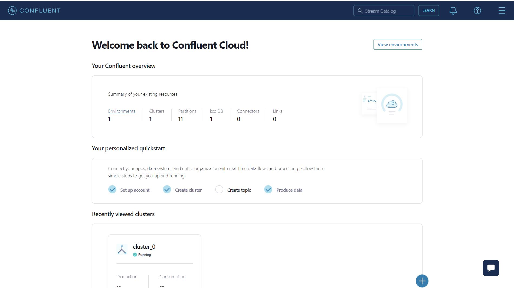
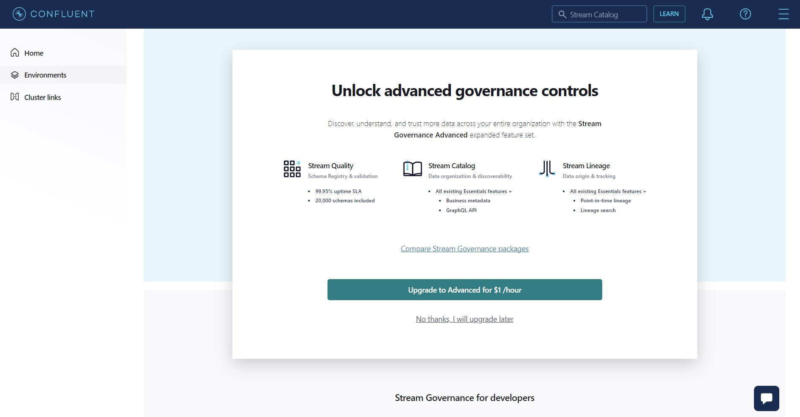
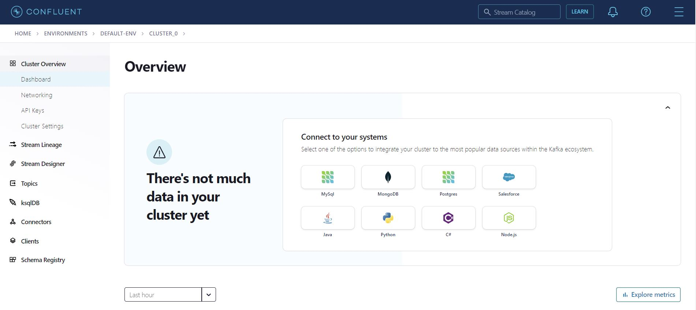

# Lab1 - Interact with Confluent Cloud

In this lab, you will interact with Confluent Cloud using the UI and, if time permits, the CLI.

## Prerequisites

For this lab and the following ones, you will need to obtain some credentials. They can be found in the following Google Drive link: https://drive.google.com/drive/u/0/folders/1Y4rnqlFoYTdwUx68J6FdtMVHgPzITGmo

Please ensure that you have access to the directory. If not, please send a message in the chat to inform the trainer.

## Connect to Confluent Cloud
Check your email and accept the invitation to access Confluent Cloud. Once accepted, follow the steps to log in to the platform.

You should observe something like this:


## First journey in Confluent Cloud

In this interface you can see an overview of the resources deployed in the platform. 
Each resource must de deployed in a specific Environment and Cluster.

Each student has already been assigned an environment and a cluster, created with their name with the syntax \<your-name\>_training (for instance for the student lucas STERNA, the according environment is lucas_sterna_training). To access yours, navigate through all the environments and clusters, locate yours, and click on it.

You should now see the following screen:

For the need of this training we will not used advanced features of stream governance. Click on No Thanks, I will upgrade later.

You will then be presented with the following interface:


A short description of the section of the left:

### Cluster Overview
The Cluster Overview page provides an overview of your Confluent Cloud cluster.

### Stream Lineage
The Stream Lineage page provides a visual representation of the data flow within your Confluent Cloud cluster. This allows you to easily identify and troubleshoot any issues with your data pipeline.

### Stream Designer
The Stream Designer page allows you to create and edit real-time data streams using a drag-and-drop interface. You can easily connect different sources and sinks, and apply transformations to your data streams.

### Topics
The Topics page allows you to manage the topics within your Confluent Cloud cluster. You can create new topics, view topic details, and configure topic settings.

### ksqldb
ksqldb is a SQL-based stream processing engine that is fully integrated with Confluent Cloud. It allows you to perform real-time data processing using SQL-like commands, and provides a powerful and flexible way to work with streams of data.

### Connectors
The Connectors page allows you to manage the connectors within your Confluent Cloud cluster. You can create new connectors, view connector details, and configure connector settings.

### Clients
The Clients page allows you to manage the clients that are connected to your Confluent Cloud cluster. You can view client details and configure client settings.

### Schema Registry
The Schema Registry page allows you to manage the schemas within your Confluent Cloud cluster. You can create new schemas, view schema details, and configure schema settings.

## Create your first topic using UI
-  Go to the "Topics" section
- Click on the "Add Topic" button
- Enter a name for your topic and let the default parameters
- Explore quickly available options on the interface
- Click "Create" to create the topic
- Skip the step to create a Schema for the topic
- Click on the topic you just created
- Click on the messages section
- Click on produce a new message to this topic
- Inspect the message you just created


We will explore Connectors, Schema registry and ksqldb later in the next labs.

## **Bonus**: Confluent Cloud CLI

### Set environment variables in the Dockerfile
In the drive https://drive.google.com/drive/u/0/folders/1Y4rnqlFoYTdwUx68J6FdtMVHgPzITGmo open the file confluent_credentials.txt and search for your name. 

Copy the content of the json containing your name and paste it in dockerfile to replace default environment variable by those in the confluent_credentials file.


Build Docker image that you will use to interact with Confluent Cloud
```bash
docker build -t confluentcloudcli .
```

Run Docker Image
```bash
docker run -t -d --name confluentcloudcli confluentcloudcli
```

Lancez un bash dans l'image docker
```bash
docker exec -it confluentcloudcli /bin/bash
```

### Explore existing resources

List all Confluent Cloud environments.
```bash
confluent environment list
```
List all cluster on the environment you just set up using environment variables.
```bash
confluent kafka cluster list
```

Check for already existing topics: 
```bash
confluent kafka topic list
```

### Create your first topic


You can see the topic you created few minute ago is present in the list.<br>
Now create your first topic with the CLI:
```bash
confluent kafka topic create --partitions 3 first_cli_topic
```

N.B: The topic creation process and many other can be launch using infrastructure deployment automation solution like terraform.
### Produce your first messages
Run
```bash
confluent kafka topic produce --help
```
Then
```bash
confluent kafka topic produce first_cli_topic
```
The tool prompts you with a >.

At this prompt type:
```bash
My first message
```
and click Enter

Then type
```bash
My second message
```
Then type
```bash
My third message
```

Exit from the producer by typing ctrl+C

Now we will retrieve data. Start a consumer.
```bash
confluent kafka topic consume --from-beginning first_cli_topic
```
You should see the messages that you produced before.

The default behavior of the producer command line is to send message without key. To Visualize that click on the topic first_cli_topic in the UI and inspect the content.

N.B: you can change the visualization option if you click on the icons at the right of the screen.

### Use key to produce message
In this section you will produce message with keys.

Create a payload that will be submitted to CLI producer:
```bash
for key in {0..20}; do for value in {0..5}; do echo key $key:message $value; done; done > payload.txt
```

Start a consummer that will consummed message from only one partition:
```bash
confluent kafka topic consume --partition 2 --print-key first_cli_topic
```

Then send the payload to Kafka:
```bash
cat payload.txt | confluent kafka topic produce --parse-key first_cli_topic
```
You can observe that the partition only contained a subset of all the keys.

If you try to produce new message with the same key in the topic, the same partition will receive the message.

Now if you consume without specifying a partition you will receive all the messages.

## Exit and clean your environment

press ctrl+D to exit the bash. Then run the command below.

```bash
docker stop confluentcloudcli && docker rm confluentcloudcli
```