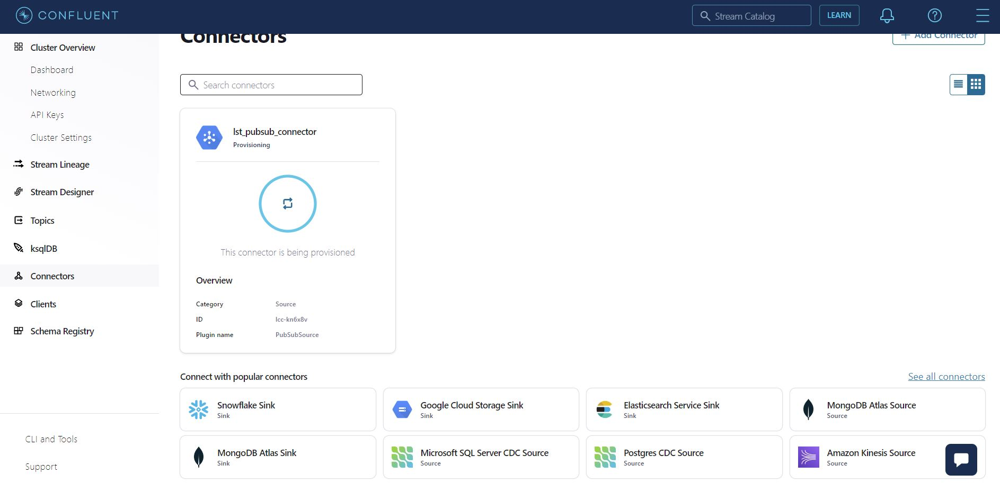

# Lab2 - Ingest data into Confluent Cloud
In this lab, we aim to ingest data into Confluent using its built-in connectors. Confluent has a strong integration with GCP. We will source data from PubSub, one of GCP's messaging systems.

## Prequisites
You will need to access to a GCP resource for this lab. To have access you must download the gcp_sa_key.json from the drive https://drive.google.com/drive/u/0/folders/1Y4rnqlFoYTdwUx68J6FdtMVHgPzITGmo and store it in a path you can access from your labtop.

## Create PubSub connector
In your kafka cluster go to the section connectors on the left. In the search bar type PubSub.

Then click on the connector displayed on the screen

You should see an output similar to the picture below: 

Click on Add new topic and fill the required information:

- Topic name: twitter_ingest
- partitions: 3

Click on Save and Create.

Select the topic you just created an click on Continue

Now you need to generate an API key and secret that your connector can use to communicate with your Kafka cluster.
For this tutorial we will select Global access, but be aware in a production environment a Granular access should be prefered. Click on generate api key and continue.

Click on GCP crendentials file and add the path to gcp credentials file you downloaded before.

In the section GCP Pub/Sub details Fill in the following information:

- Pub/Sub Project ID: par-kafka-training
- Pub/Sub Topic ID: twitter-ingestion
- Pub/Sub Suscription ID: \<your-name\>_twitter-ingestion-subscription (for instance for the student lucas STERNA, the according subscription is lucas_sterna_twitter-ingestion-subscription)

Leave the default configuration and continue.

Leave the number of tasks on 1 and continue.

Change the connector name by: pubsub_connector and continue.

You should observe on the screen:

Congratulation you create your first connector. Few minutes after the provisioning you should receive a notification that the connector is ready.
Click on the connector and observe the metrics.

Now go on the topic and inspect the content of the messages sent by the connector:

