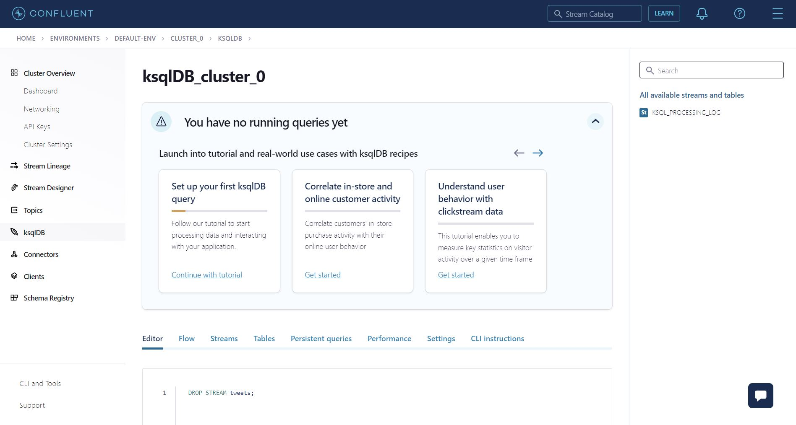

# Lab3 - Process 

## Create your first stream:
In the Kafka cluster page, go to ksqlDB section on the left of the screen. Click on the cluster name.

You should see something similar to the image below:


Go to the editor section and type:
```bash
CREATE STREAM tweets (
  MessageData VARCHAR
) WITH (KAFKA_TOPIC='twitter_ingest', VALUE_FORMAT='JSON');
```
This query creates a stream called "tweets" with a field named "MessageData" of type "VARCHAR". This field regroups the data imported by the connector in the previous lab. 
The stream is associated with the Kafka topic "twitter_ingest" and the data is formatted as JSON.

## Sanitized tweets ingested with PubSub

```bash
CREATE OR REPLACE STREAM TWEETS_SANITIZED AS 
SELECT 
    EXTRACTJSONFIELD(TWEETS.MESSAGEDATA, '$.id') ID,
    EXTRACTJSONFIELD(TWEETS.MESSAGEDATA, '$.user') USER,
    EXTRACTJSONFIELD(TWEETS.MESSAGEDATA, '$.created_at') CREATED_AT,
    EXTRACTJSONFIELD(TWEETS.MESSAGEDATA, '$.lang') LANG,
    REGEXP_SPLIT_TO_ARRAY(REGEXP_REPLACE(EXTRACTJSONFIELD(TWEETS.MESSAGEDATA, '$.tags'), '\[|\]|\\"|\"', ''), ',') TAGS,
    EXTRACTJSONFIELD(TWEETS.MESSAGEDATA, '$.text') TEXT,
    EXTRACTJSONFIELD(TWEETS.MESSAGEDATA, '$.sentiment') SENTIMENT
FROM TWEETS
EMIT CHANGES;
```
- This query creates or replaces a stream named "TWEETS_SANITIZED" using data from another stream called "TWEETS". 
- The query extracts several fields from the JSON data in the "MESSAGEDATA" field of the "TWEETS" stream. 
- The extracted fields include "ID", "USER", "CREATED_AT", "LANG", "TAGS", "TEXT", and "SENTIMENT". 
- The query also uses the "REGEXP_SPLIT_TO_ARRAY" and "REGEXP_REPLACE" functions to convert the tag inferred as a varchar in an array. 
- The "EMIT CHANGES" clause indicates that this new stream will be updated in real-time based on changes made to the "TWEETS" data source.

Now inspect the content of the stream you just created:
```bash
SELECT * FROM TWEETS_SANITIZED LIMIT 100;
```

## Difference between pull and push queries
**Pull Queries**: Pull queries are used to retrieve data from a ksqlDB stream or table on demand. it enables you to fetch the current state of a materialized view, a table or a stream. The result of this statement is not persisted in a Kafka topic and is printed out only in the console. They're a great match for request/response flows.

example:
```bash
SELECT * FROM mystream LIMIT 10;
```

**Push Queries**: Push queries are used to subscribe to a ksqlDB stream or table and receive real-time updates as new data is added to the stream or table. The ksqlDB server actively pushes the updates to the client. They’re a good fit for asynchronous application flows. Push queries can use all available SQL features, which can be useful when prototyping.

```bash
SELECT * FROM mystream EMIT CHANGES;
```
## Stream monitoring
You can have a look in the sections Flow, Streams, Persistent queries, Performance:
- Flow: you can see the flow of your streams
- Streams: you can see the name of the streams you created
- Persistent queries: Persistent queries that are running
- Performance: the performance of the cluster

## Calculate twitter trends
Create a new stream where tags are exploded:

```bash
CREATE OR REPLACE STREAM TAGS
WITH 
(FORMAT='json',KAFKA_TOPIC='TAGS')
AS SELECT 
id, 
lang,
sentiment,
explode(tags) tag 
FROM  TWEETS_SANITIZED
EMIT CHANGES;
```
- This query creates a new stream called TAGS or replaces an existing stream with the same name.
- It specifies the format of the data in the stream to be JSON, and the Kafka topic to which the stream will be written as TAGS.
- It selects data from a source stream or table TWEETS_SANITIZED and performs the following operations:
- It selects columns id, lang, sentiment from the source stream/table.
- It uses the explode function to expand the tags column into separate rows, creating a new column tag.
- The result of the query is a new stream TAGS containing the selected columns with the expanded tags column.

To observe the result you can run the following command:
```bash
SELECT * FROM TAGS LIMIT 100;
```
Or directly go to the topic section and inspect the topic TAGS.

Then create a new stream keyed by tag:
```bash
CREATE OR REPLACE STREAM TAGS_KEY_TAG WITH
(kafka_topic='tags_key_tag',format='json')
AS
SELECT * FROM TAGS
PARTITION BY tag
EMIT CHANGES;
```

Calculate the sentiment associated to each tag on a windows of 5 minutes.

```bash
SELECT tag, COUNT(tag) as cnt_tag, HISTOGRAM(sentiment) as hist_sentiment
  FROM TAGS WINDOW TUMBLING (SIZE 5 MINUTE)
  WHERE lang='en'
  GROUP BY tag
  EMIT CHANGES;
```
The result of the query contains the count of each tag and the histogram of the sentiment values, both calculated over a tumbling window of size 5 minutes and filtered to only include rows where the english language. The stream will update in real-time as new data is added to the source stream TAGS.

## EMIT CHANGES VS EMIT FINAL
In ksqlDB, the EMIT CHANGES and EMIT FINAL clauses determine the behavior of a query when new data is added to the source stream or table.

EMIT CHANGES: The query will continuously update and emit new results as new data is added to the source stream or table. Each time new data is added, the query will re-run and the result will reflect the updated state of the source.

EMIT FINAL: The query will run once and emit the final result when the query is executed. The result will not update as new data is added to the source stream or table.

In general, the choice between EMIT CHANGES and EMIT FINAL depends on the desired behavior of the query. If real-time updates are needed, EMIT CHANGES should be used. If a one-time calculation or snapshot of the data is needed, EMIT FINAL should be used.

## Create a table to store tweet trends
Now that we have prototyped our final result, we will store it in a ksqlDB table. Note that we will used a EMIT FINAL rather EMIT CHANGES in this case to suppress the intermediate results until the window closes.

```bash
CREATE OR REPLACE TABLE tweet_trend WITH
(kafka_topic='tweet_trend',format='json')
 as 
SELECT tag, COUNT(tag) as cnt_tag, HISTOGRAM(sentiment) as hist_sentiment
  FROM TAGS WINDOW TUMBLING (SIZE 20 MINUTE)
  WHERE lang='en'
  GROUP BY tag
  EMIT FINAL;
```