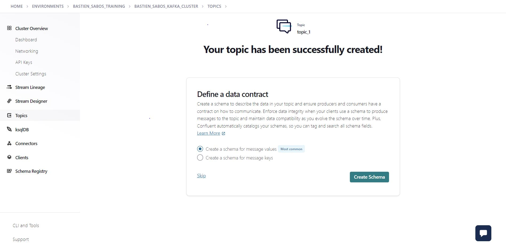
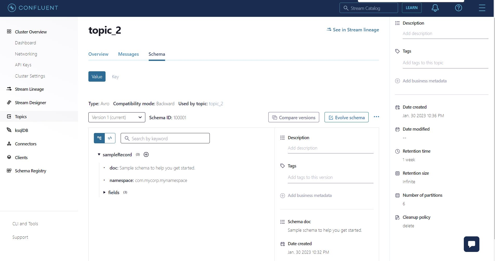

# Lab4 - Implementing Data Governance
In this lab we will explore basic feature of Schema registry:

First of all you will create your first schema. Go to the topic section, then click on Add topic. Fill the required configuration and click on Create with defaults.

Then click on Create Schema. Leave default configuration:


Click on Create. 

Congratulations you create your first schema.

Now we will serialize data in avro using KSQLDB and an auto generate schema. Go to ksqldb section and click on the instance. Then run in the editor:
```bash
CREATE STREAM tag_avro_stream
    WITH (KAFKA_TOPIC='tag_avro_stream',
          PARTITIONS=3,
          VALUE_FORMAT='avro') AS
    SELECT * FROM tags_key_tag;
```

Then go to the topic section and select the topic tag_avro_stream then inspect the schema.

## **Bonus**: Inject tags in BQ

Now that we have built our stream of tags associated with sentiments, we are going to re-inject it into GCP for more massive analysis. We will therefore dump the results into BQ.

Search for the "Google BigQuery Sink" connector, then next.

Select the tag_avro_stream topic, then next.

Now you need to generate an API key and secret that your connector can use to communicate with your Kafka cluster.
For this tutorial we will select Global access, but be aware that in a production environment, Granular access is preferred. Click on generate api key and continue.

Click on GCP crendentials file and add the path to gcp credentials file you downloaded in the lab2. 

Enter: 
  - projectId: par-kafka-training
  - dataset: sfeir_kafka_training_kafka_connector_eu

Click on Continue.

For Input Kafka record value format select AVRO, in advanced configurations set `Auto create tables` to true then continue.
Leave tasks parameter to 1.

Name your connector bigquery_connector and continue.
